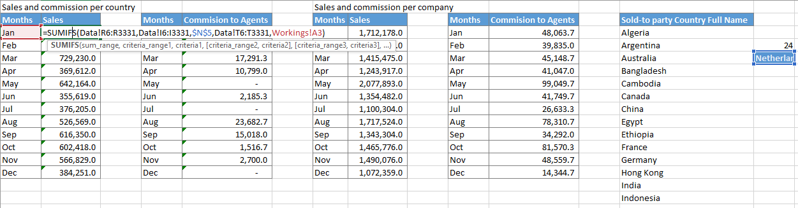
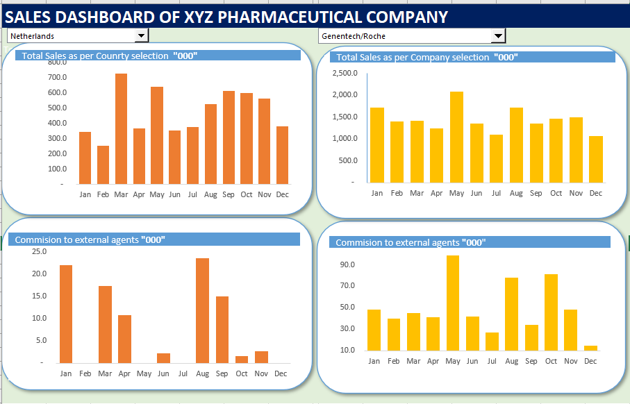

# Pharmaceutical-Sales-Analytics-Dashboard
### Project Overview
This project  aims to design a dashboard for a pharmaceutical company to analyze the sales of products across various regions and brands. It wants to create a charts with User control functionality, so users can easily see the total Sales and **commission of external agents** categorized by brands and region.
The company’s database keep’s track of following data fields:
Brand Name, Company Name, Disease Medical Use, Invoice date, Company code, Ship-to-Country, Ship-to-Country Full Name, Sold-to party- Code, Sold-to party Country, Sold to party Country Full Name, Delivery Plant,	Payment terms,	External Agent,	Sales quantity,	Price TC /Kg, Revenue, External commissions, Month.

### Problem Statement
The pharmaceutical company operates in a competitive market where analyzing sales performance across multiple brands and regions is crucial for informed decision-making. However, the current sales data is stored in a raw and unstructured format, making it challenging to extract meaningful insights.

Key challenges include:

Difficulty in analyzing total sales and external agent commissions due to the lack of consolidated and interactive reporting tools.

Limited visibility into sales performance categorized by brand and region, hindering targeted strategies.

Time-consuming manual processes for generating reports and identifying trends.

To address these challenges, an Excel-based interactive dashboard is needed. This solution will enable the analytics team to:

Visualize sales data in an intuitive and dynamic manner.

Filter and categorize sales metrics by brand, region, and other key dimensions.

Make data-driven decisions to improve sales strategies and optimize agent commissions.

### Data sources

The data for this project was sourced from [Simplilearn](https://www.simplilearn.com/). It includes a wide range of fields that capture essential information for analyzing sales performance, agent commissions, and regional breakdowns. The dataset was exported in Excel format for analysis and dashboard creation.

[Dataset](Pharma_Datasets.xlsx)

### Data Preparation

The dataset required cleaning and transformation to ensure accuracy and consistency, including:

Removing duplicates and irrelevant fields.

Formatting date fields for time-based analysis.

Creating calculated fields for key metrics, such as total sales and agent commissions.

### Data Analysis

The data analysis process for this project involved several structured steps to create a dynamic, interactive Excel dashboard that visualizes sales amounts and external agent commissions by countries and companies. The analysis steps are outlined below:

**Creating Combo Boxes**
To enable user interactivity, combo boxes were created for Country and Company selections.

**Dynamic Data Fetching**
Using the OFFSET function, dynamic cell references were established to fetch selected values:

**Calculating Sales and Commissions**
To summarize sales and external agent commissions based on user selections, **SUMIFS** formulas were used.

The formulas incorporated user-selected criteria  for Country and for Company enabling automatic updates based on combo box inputs.

 **Creating Column Charts**
To visually represent the summarized data:

Column charts were created for both Country-Based and Company-Based tables.

Charts were customized for clarity and relocated to the dashboard sheet for better visualization.

### Conclusion and Recommendations

The Pharmaceutical Sales Analytics Dashboard successfully addresses the challenges of analyzing sales performance and external agent commissions across multiple regions and brands. By leveraging Excel’s interactive features, such as combo boxes, dynamic formulas, and visualizations, the dashboard provides a user-friendly and dynamic solution for sales data analysis.

Key outcomes include:

Enhanced visibility into total sales and agent commissions, categorized by countries and companies.
Simplified and efficient data exploration through dynamic filters for real-time analysis.
Intuitive visualizations that support better decision-making and performance tracking.
This solution empowers the analytics team to identify trends, monitor performance, and optimize strategies with minimal manual effort.

### Recommendations

To further enhance the dashboard’s functionality and usability, the following recommendations are proposed:

**Automated Data Updates:** 
Integrate the dashboard with the company's database or automate the data refresh process using Power Query. This will ensure the dashboard reflects real-time data without manual updates.

**Integration with Power BI:**
For advanced analytics and scalability, consider migrating the solution to Power BI. This would enable richer visualizations, larger data handling, and automated reporting.

By implementing these recommendations, the dashboard can evolve into a more robust and versatile tool, supporting strategic planning and driving business growth.

